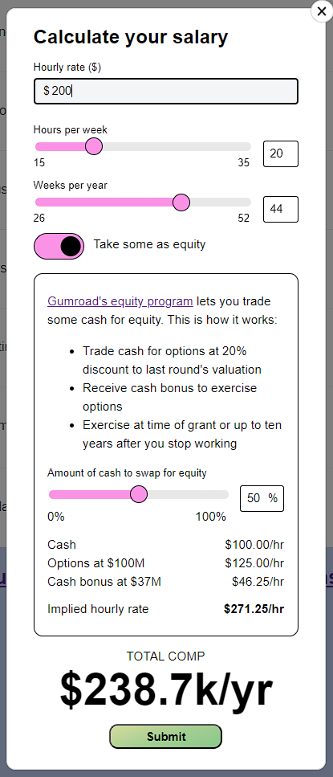
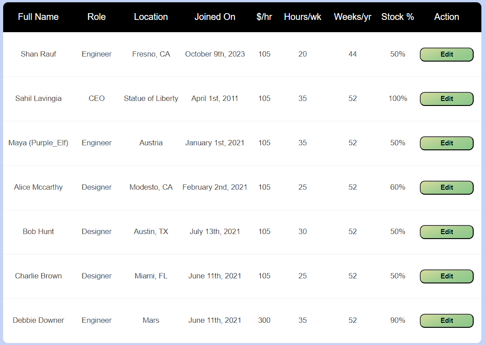

# Flexile Compensation Picker Demo

A functional prototype of Sahil's Figma mockup to configure compensation packages on Flexile.

Demo here: 

## Compensation Picker Widget

## Contractor Directory

## Notes

- Unsure if my math is right on the cash bonus; my value is $0.91 cents higher than Sahil's value but... Maybe he did the  math roughly in his head?
- Design-wise, the gigantic total comp number isn't great I think? It obscures actual yearly cash, how much it'd cost to exericse options, etc
